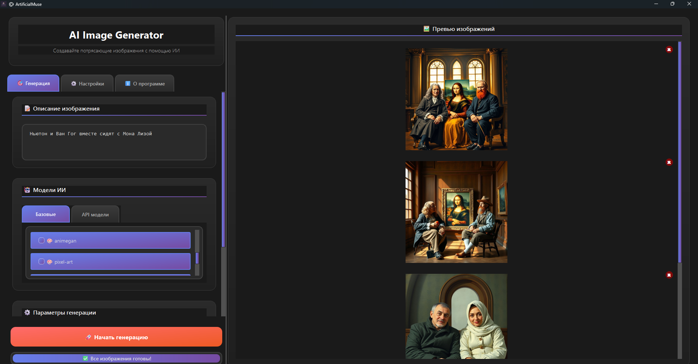
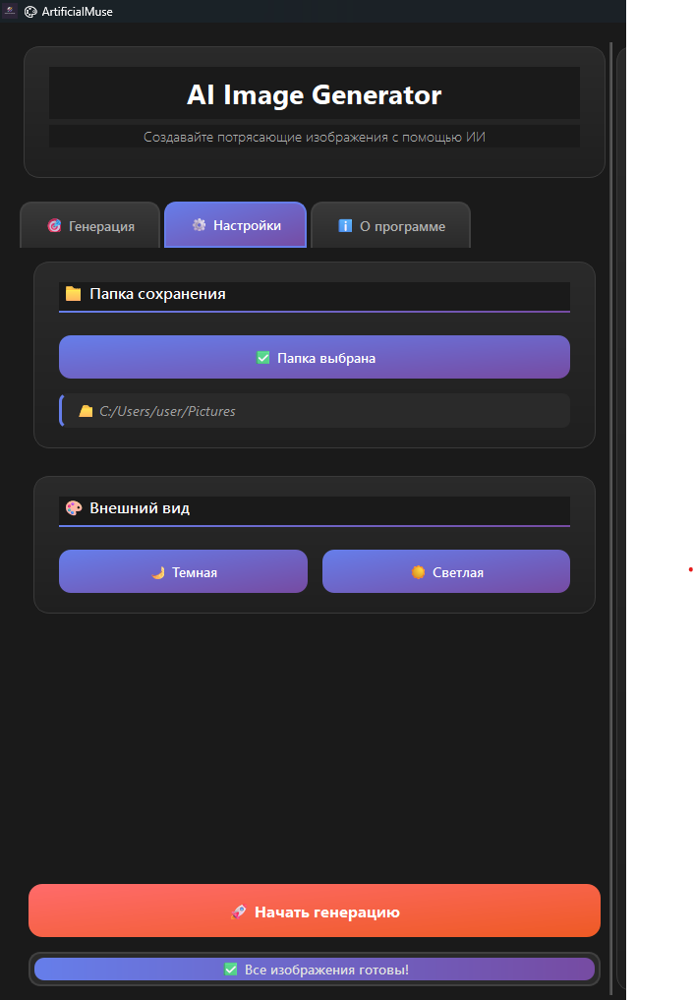

# AI Image Generator Pro

A modern desktop application for generating AI images using various models through the Pollinations.AI API.

## 🌟 Features

- Multiple AI model support (local and API-based)
- Batch image generation
- Custom image size presets
- Real-time image preview
- Dark and light themes
- Modern, user-friendly interface
- Image management capabilities
- Progress tracking

## 🛠️ Installation

1. Clone the repository:

```sh
git clone https://github.com/your-username/ai-image-generator-pro.git
cd ai-image-generator-pro
```

2. Install required dependencies:

```sh
pip install -r requirements.txt
```

## 📦 Dependencies

- PySide6 - Modern Qt-based UI framework
- Pillow - Image processing library
- Requests - HTTP library for API calls

## 🚀 Usage

Run the application:

```sh
python main.py
```

### Basic Steps:

1. Enter your image description
2. Select AI models to use
3. Choose image size and quantity
4. Select save directory
5. Click "Generate" and wait for results

## 🎨 Features in Detail

### Image Generation

- Support for multiple AI models
- Custom image dimensions
- Batch processing
- Progress tracking
- Error handling

### User Interface

- Modern, responsive design
- Dark/Light theme support
- Real-time preview
- Image management tools
- Intuitive controls

### Image Management

- Preview generated images
- Delete unwanted results
- Batch selection operations
- File organization

## 🔧 Configuration

The application uses the following default models:

- flux-pro
- stable-diffusion
- vqgan-clip
- midjourney
- animegan
- pixel-art
- watercolor
- oil-painting

## 📝 License

[Your License Here]

## 👤 Author

**Ronew2J**

- Telegram: [@RonewJJ](https://t.me/RonewJJ)
- Email: ronew2j@gmail.com

## 🤝 Contributing

Contributions, issues, and feature requests are welcome!

## 📸 Screenshots

### Main Interface


### Generated Images Gallery



### Settings Panel



The application features a modern, intuitive interface with dark/light theme support, real-time image preview, and comprehensive image management capabilities.
